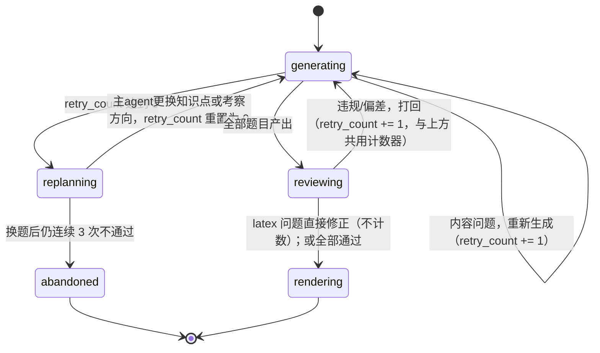

# Agent 设计规格

本文档把 [idea.md](./idea.md) 中「主 agent 规划」「子 agent 出题」「审查」三段构想收敛为可直接实现的角色职责、算法、协议与提示词模板。术语见 [README.md](./README.md#术语表)；状态机与 fan-out 调度见 [architecture.md](./architecture.md)。

## 角色划分

| 角色 | 输入 | 输出 | 可用工具 | 模型档位 |
| --- | --- | --- | --- | --- |
| 规划 agent（planner） | 时长、往期试卷全文（0~N 份）、重点清单、用户额外要求、共享库检索结果 | `plan_item[]` | 往期试卷读取、共享库检索（只读） | 强模型——需要跨维度权衡占比、去重、参考来源判定，能力不足会导致规划质量差且难以在下游发现 |
| 选择题 agent（choice_writer） | 全部选择题的 `plan_item[]` | 通过 `create_choice_question` 产出的题目集合 | 知识点检索、`create_choice_question` | 性价比模型——单题任务简单，靠数量摊薄成本 |
| 填空题 agent（blank_writer） | 全部填空题的 `plan_item[]` | 通过 `create_blank_question` 产出的题目集合 | 知识点检索、`create_blank_question` | 性价比模型 |
| 简答题 agent（short_writer） | 单个简答题的 `plan_item` | 通过 `create_short_answer_question` 产出的 1 题 | 知识点检索、`create_short_answer_question` | 性价比模型，但需要更长上下文——简答题检索量与输出量都大于选择/填空题，单题独占上下文换取质量（idea.md 明确要求） |
| 审查 agent（reviewer） | 全部题目 + 对应 `plan_item` | `review_result`（通过/打回/直接修正列表） | 无（纯文本判断，不调用工具变更题目，打回后由 writer 重新生成） | 中等模型，需要稳定的结构化判断而非创造性输出 |
| 压缩 agent（compressor） | 超长的重点清单 / 用户额外要求原文 | 压缩后的文本 | 无 | 轻量模型即可，任务是摘要而非推理 |

分工理由对应 idea.md 原文：选择题/填空题各一个 agent 包全部同题型，是为了在同一上下文内自然避免选项风格雷同与答案分布失衡；简答题每题一个 agent，是为了给需要深度检索与长输出的题型独占上下文换取质量。

## 规划产物 schema

```json
{
  "id": "aa11...",
  "seq": 7,
  "question_type": "short_answer",
  "knowledge_point": "LTI 系统的稳定性判据",
  "exam_direction": "由频率响应推导冲激响应并判断 BIBO 稳定性",
  "difficulty": "medium",
  "reference_source": {
    "type": "past_paper",
    "upload_id": "3a91d0f2-...",
    "original_seq": 12,
    "reuse_mode": "light_edit"
  }
}
```

`reference_source` 为空表示该题无强参考性质，子 agent 需要独立设计题目内容。`reuse_mode` 取值见第 6 节判定树。

**关键约束（idea.md 明确要求）**：`knowledge_point`、`exam_direction`、`difficulty` 三个字段**不作为出题 tool 的独立参数传递**给子 agent 的工具调用。它们只经由提示词进入子 agent 的推理过程，最终落地方式是在合成的 md 中以 HTML 注释形式隐式保存：

```markdown
<!-- plan_item: seq=7 knowledge_point="LTI 系统的稳定性判据"
     exam_direction="由频率响应推导冲激响应并判断 BIBO 稳定性"
     difficulty="medium" reference_source="past_paper:3a91d0f2-...#12" -->
```

这样出题 tool 的 schema 保持精简，只关心题目本身（题干、选项、答案、解析），不携带规划元信息；PDF 渲染时 HTML 注释不可见，不影响最终版式。

## 1. 题量推导

时长 → 具体题数。idea.md 只说「默认 100 分钟，agent 自主决定题量」，未给出可执行规则。落地为单位耗时基准表：

| 题型 | 单位耗时（分钟/题） |
| --- | --- |
| 选择题 | 1.5 |
| 填空题 | 1.5 |
| 简答题 | 6 |

规划 agent 在下列区间内自主决定各题型题数，使总耗时落在时长的 85%~100%（留出检查作答时间，不占满全部时长）：

```
Σ(题数_i × 单位耗时_i) ∈ [0.85 × duration_minutes, 1.0 × duration_minutes]
```

**有往期试卷时**：以往期试卷题数为锚点，按时长比例缩放后取整，再用上述区间校验；缩放结果超出区间时以区间边界为准。

**算例（100 分钟，无往期试卷，模板占比 20/20/60）**：

1. 区间为 `[85, 100]` 分钟
2. 先按模板占比试算总题数 `N`：设 `N` 题，选择 `0.2N` 题 × 1.5 + 填空 `0.2N` 题 × 1.5 + 简答 `0.6N` 题 × 6 = `0.6N + 3.9N = 4.5N` 分钟
3. 令 `4.5N ∈ [85, 100]` → `N ∈ [18.9, 22.2]`，取 `N = 21`
4. 按第 4 节的最大余额法分配：选择 4 题、填空 4 题、简答 13 题（`4×1.5 + 4×1.5 + 13×6 = 90` 分钟，落在区间内）

**算例（100 分钟，有一份往期试卷，题数 24，占比 25%/20%/55%）**：

1. 往期试卷时长设定通常已知（如 100 分钟），若不同则按比例缩放：`24 × (100/原时长)`，四舍五入
2. 缩放结果若落在 `[18.9, 22.2]` 之外，则退回该区间内取值；若在区间内，直接使用缩放后的题数作为 `N`
3. 用 `N` 与原占比走第 4 节分配算法

## 2. 题型占比分配

相对 ±10% → 整数题数。idea.md 明确要求「相对变动」而非绝对变动（原占比 30% → 允许 27%~33%，而非 20%~40%），目的是避免占比本身较小的题型被大幅压缩甚至消失。算法：

1. 由参考（往期试卷或模板）得各题型占比 `p_i`，`Σp_i = 1`
2. 允许区间 `[0.9 p_i, 1.1 p_i]`
3. 目标题数 `n_i = round(N × p_i)`，用**最大余额法**保证 `Σn_i = N`：
   - 先取 `floor(N × p_i)` 作为各题型基础题数
   - 按 `N × p_i` 的小数部分从大到小排序，依次 +1，直到总数等于 `N`
4. 校验 `n_i / N` 是否落在 `[0.9 p_i, 1.1 p_i]`；若某题型因取整偏出区间，在其余题型间做最小调整（从偏差最大的题型借一题给偏差方向相反的题型），再重新校验
5. **保护规则**：任何 `p_i > 0` 的题型，`n_i` 至少为 1——这正是 idea.md 选择「相对变动」而非「绝对变动」的原因，绝对变动在小占比题型上会直接把题数压到 0

**边界**：往期试卷题型只有一种时，按该题型 100% 处理，相对变动约束自动满足（无需分配）。

## 3. 多份往期试卷的综合

idea.md 要求「若存在多份应当综合参考取其较大共同点，具体包括题型分布、知识点覆盖、难度分配三个维度」。落地为三步：

1. **题型分布**：对每份试卷算占比 `p_i^{(k)}`（`k` 为第几份试卷），取各题型占比的平均值作为综合占比，再走第 4 节分配算法
2. **知识点覆盖**：取各份试卷知识点集合的**交集优先**——多份试卷共同出现的知识点权重更高，仅单份出现的知识点作为补充候选，不作为必须覆盖项
3. **难度分配**：各份试卷难度标签（easy/medium/hard）占比同样取平均值，作为规划时的难度配比参考

三个维度独立计算后一并写入规划提示词，由规划 agent 综合判断，不强制加权公式——语义层面的「较大共同点」判断留给强模型自身完成。

## 4. 重试与换题协议

idea.md 规定「非语法错误问题连续重新生成超过 3 次仍不通过，子 agent 不再继续重试，而是向主 agent 申请更换本题」，以及审查阶段的打回「计入子 agent 出题阶段所述的 3 次上限」。落地为统一的计数规则：

| 触发来源 | 原因分类 | 是否计入 3 次上限 | 处置 |
| --- | --- | --- | --- |
| 子 agent 自检 | `schema_invalid`（tool 参数不合法，如选择题缺选项） | 否 | 直接要求 agent 修正格式后重发，不算一次失败尝试 |
| 子 agent 自检 | `violation`（内容违规） | 是 | 重新生成 |
| 子 agent 自检 | `deviation`（与规划偏差超限，四维评分 <80，见第 8 节） | 是 | 重新生成 |
| 审查阶段打回 | `violation` / `deviation` | 是，**与子 agent 阶段共用同一个计数器**（idea.md 明确要求） | 打回给对应 writer 重新生成 |
| 审查阶段直接修正 | `latex_unrenderable`（公式无法渲染） | 否 | 审查 agent 直接改写为等价可渲染形式，不触发重新生成 |

状态机：



**防无限循环**：`retry_count` 是每道题（`question` 行）落盘的全局计数器，不因换题而失去追溯——`plan_item.superseded_by` 记录换题链。若换题后新规划项再次耗尽 3 次，直接放弃该题（`question.status = abandoned`），任务转 `partially_completed`，不会无限换题。

`request_replan` 协议的调用形态：

```json
{
  "action": "request_replan",
  "question_seq": 9,
  "plan_item_id": "aa11...",
  "reason": "连续 3 次生成的题目均与规划的考察方向偏离（四维评分 <80）",
  "attempts": [
    {"attempt": 1, "reason": "deviation", "score": 62},
    {"attempt": 2, "reason": "deviation", "score": 71},
    {"attempt": 3, "reason": "violation", "score": null}
  ]
}
```

主 agent 收到后产出新的 `plan_item`（新的 `knowledge_point` 或 `exam_direction`），`old_plan_item.superseded_by = new_plan_item.id`，`question.retry_count` 重置为 0，重新下发给对应 writer。

## 5. 考察方向去重自查

idea.md 明确要求「由主 agent 基于自身对题目内容的语义理解进行自查判定，不依赖额外的向量相似度等基础设施」。落地为规划阶段的自检清单，写入提示词：

> 在最终确定 `plan_item[]` 之前，逐项检查：
> 1. 是否存在两道以上题目考察同一知识点的相同或高度相似的方向？（判断依据：`exam_direction` 描述的解题路径、涉及的关键概念是否实质重合，而非表面文字是否相同）
> 2. 若发现三道及以上命中，保留其中考察角度最典型的两道，其余替换为该知识点的其他考察方向，或替换为其他知识点
> 3. 输出前再通读一次全部 `plan_item[]` 的 `knowledge_point` + `exam_direction` 组合，确认没有遗漏

这一自查是规划 agent 输出前的必经步骤，不是可选项；提示词模板见第 9 节。

## 6. 参考来源沿用判定树

idea.md 要求「若该参考来源仅为简单题，如单纯计算题，或概念性填空题，则不应该做太大改动……这是『不能将原题原封不动搬上来』这一原则的唯一例外」。子 agent 收到 `plan_item.reference_source` 后按下列判定树决定改写幅度：

```
plan_item.reference_source 是否存在？
├─ 否 → 独立设计题目内容，不参考任何原题
└─ 是 → 原题属于哪一类？
    ├─ 简单计算题（数值代入型，解法路径固定）
    │   → reuse_mode = "value_only"：保留题型结构与解法路径，仅修改数值/参数
    ├─ 概念性填空题（对某现象/定义/性质的解释类题目）
    │   → reuse_mode = "verbatim"：允许原封不动迁移
    │      **这是 FR-12「不得原样照搬」的唯一例外，实现时不应对此类题目加原创性校验**
    └─ 其他（选择题、简答题的推导/论述类内容、非概念性填空题）
        → reuse_mode = "rewrite"：必须实质改写——换情境、换考察角度、换设问方式，
          仅保留知识点层面的关联，题干不能与原题高度相似
```

`reuse_mode` 的三个取值对应第 2 节 schema 中 `reference_source.reuse_mode` 字段，子 agent 依据该值决定改写策略，无需重新判断原题类型。

## 7. 出题 Tool Schema

三个 tool 分别对应选择题、填空题、简答题。`need_explanation` 决定 `explanation` 字段是否出现在 schema 中：`true` 时为必填，`false` 时该字段不在 schema 里出现（而不是允许为空）——避免模型在不需要解析时仍然生成解析内容。

### create_choice_question

```json
{
  "name": "create_choice_question",
  "description": "提交一道选择题",
  "parameters": {
    "type": "object",
    "properties": {
      "stem": {"type": "string", "description": "题干"},
      "options": {
        "type": "object",
        "properties": {
          "A": {"type": "string"},
          "B": {"type": "string"},
          "C": {"type": "string"},
          "D": {"type": "string"}
        },
        "required": ["A", "B", "C", "D"]
      },
      "answer": {"type": "string", "enum": ["A", "B", "C", "D"]},
      "explanation": {"type": "string", "description": "仅 need_explanation=true 时出现"}
    },
    "required": ["stem", "options", "answer"]
  }
}
```

### create_blank_question

```json
{
  "name": "create_blank_question",
  "description": "提交一道填空题",
  "parameters": {
    "type": "object",
    "properties": {
      "stem": {"type": "string", "description": "题干，空位用 ______ 表示"},
      "answer": {"type": "string"},
      "explanation": {"type": "string", "description": "仅 need_explanation=true 时出现"}
    },
    "required": ["stem", "answer"]
  }
}
```

### create_short_answer_question

```json
{
  "name": "create_short_answer_question",
  "description": "提交一道简答题，可含子问题",
  "parameters": {
    "type": "object",
    "properties": {
      "stem": {"type": "string", "description": "题干（背景/引题部分）"},
      "sub_questions": {
        "type": "array",
        "items": {"type": "string"},
        "description": "可选。若有子问题，按顺序列出"
      },
      "answer": {"type": "string", "description": "无子问题时的完整答案；有子问题时可写「见各子问题答案」"},
      "sub_answers": {
        "type": "array",
        "items": {"type": "string"},
        "description": "与 sub_questions 按索引严格对应，长度必须相等"
      },
      "explanation": {"type": "string", "description": "仅 need_explanation=true 时出现"}
    },
    "required": ["stem", "answer"]
  }
}
```

**校验规则（tool 层，CHECK 约束无法覆盖跨 JSONB 数组长度比较，见 [data-model.md](./data-model.md#25-规划项与题目)）**：

```python
def validate_short_answer(args: dict) -> None:
    sub_q = args.get("sub_questions")
    sub_a = args.get("sub_answers")
    # 必须同时存在或同时为空
    if (sub_q is None) != (sub_a is None):
        raise SchemaInvalid("sub_questions 与 sub_answers 必须同时提供或同时省略")
    # 长度必须相等，且按索引对应（idea.md 特别指出）
    if sub_q is not None and len(sub_q) != len(sub_a):
        raise SchemaInvalid(f"sub_questions 长度 {len(sub_q)} 与 sub_answers 长度 {len(sub_a)} 不一致")
```

`SchemaInvalid` 对应 [api.md](./api.md#5-sse-事件) 中 `question_retried` 事件的 `reason: "schema_invalid"`，不计入 3 次上限，直接要求模型修正后重发。

## 8. 审查 agent 规则

对应 idea.md 审查阶段的三项检查。审查为可选阶段（`enable_review=false` 时整个阶段跳过，见 [architecture.md](./architecture.md#4-任务状态机)）。

### 检查一：违规内容

判断题目是否包含知识库中并未明确提及的政治敏感内容，或色情等违规内容。命中 → `reason: "violation"`，打回给对应 writer 重新生成，计入 3 次上限。

### 检查二：与规划偏差超限（四维评分）

idea.md 原文「题目内容于主 agent 的规划出现超过 20% 的偏差」没有给出可计算的判定口径。落地为四维评分表，每维 25 分，满分 100：

| 维度 | 25 分判定标准 | 0 分判定标准 |
| --- | --- | --- |
| 知识点匹配 | 题目实际考察的知识点与 `plan_item.knowledge_point` 一致 | 完全考察另一知识点 |
| 考察方向匹配 | 解题路径 / 设问角度与 `plan_item.exam_direction` 一致 | 考察方向与规划无关 |
| 题型一致 | 实际产出的题型与 `plan_item.question_type` 一致 | 题型不符（tool 层已拦截，此项通常满分或不适用） |
| 难度一致 | 主观判断题目难度与 `plan_item.difficulty` 相符 | 难度明显偏离（如规划为 easy 却出现需多步推导的难题） |

**总分 < 80 判为偏差超限**，对应 idea.md 「超过 20% 偏差」的原意——把一个无法直接计算的百分比转成结构化评分。命中 → `reason: "deviation"`，打回，计入 3 次上限。

### 检查三：LaTeX 渲染兜底

检查题目中的公式是否使用了 md 渲染器不支持的宏或语法。命中 → 审查 agent 直接改写为等价可渲染形式（如把不支持的宏替换为标准 LaTeX 命令），**不打回、不计入重试**，对应 `auto_fixed` 列表。

### 审查输出

```json
{
  "checked": 24,
  "passed": 22,
  "rejected": [
    {"seq": 5, "reason": "violation", "detail": "涉及未在知识库中出现的政治人物评价"},
    {"seq": 18, "reason": "deviation", "score": 65, "detail": "题目实际考察拉普拉斯变换，规划为傅里叶变换"}
  ],
  "auto_fixed": [
    {"seq": 12, "reason": "latex_unrenderable", "detail": "\\substack 替换为 \\begin{aligned}...\\end{aligned}"}
  ]
}
```

## 9. 提示词模板

以下为各角色的骨架模板，`{{ }}` 为运行时填充的占位符。

### 规划 agent

```
你是试卷规划专家。请依据以下材料为一份试卷设计题目蓝图。

【考试时长】{{ duration_minutes }} 分钟
【往期试卷】{{ past_papers_full_text_or_none }}
【重点知识点清单】{{ keypoint_list_or_none }}
【用户额外要求】{{ extra_requirement_or_none }}
【共享库检索结果】{{ shared_library_summary }}

约束：
1. 题量推导：各题型题数 × 单位耗时（选择/填空 1.5 分钟，简答 6 分钟）之和须落在
   [{{ duration_minutes * 0.85 }}, {{ duration_minutes }}] 分钟区间内。
2. 若提供了往期试卷，各题型占比相对原占比的变动不得超过 ±10%（如原占比 30%，
   允许 27%~33%），且原本占比 >0 的题型题数不得为 0。
3. 若未提供往期试卷，检查共享库是否有同校同课程的往期试卷；仍无则按
   20% 选择 / 20% 填空 / 60% 简答的模板处理。
4. 若提供了多份往期试卷，综合取题型分布、知识点覆盖、难度分配三个维度的较大共同点。
5. 每道题需给出 knowledge_point、exam_direction、question_type、difficulty，
   若对某类材料有强参考性质需给出 reference_source。这些信息仅供内部规划使用，
   不会作为出题 tool 的参数。
6. 自查：同一知识点的相同/相似考察方向不得出现三次及以上。
7. 题目内容原则上不得与参考来源完全相同，唯一例外见 reuse_mode 判定
   （概念性填空题可原封不动迁移，简单计算题仅改数值）。

请输出 plan_item 列表，字段：seq, question_type, knowledge_point, exam_direction,
difficulty, reference_source（可空）。
```

### 选择题 / 填空题 agent

```
你负责生成本次试卷中全部{{ "选择题" if question_type == "choice" else "填空题" }}。

以下是分配给你的规划项列表（仅供理解出题方向，不会作为工具参数）：
{{ plan_items_with_metadata }}

对每一项：
1. 检索该知识点相关的知识库内容。
2. 若 reference_source 存在，按以下规则处理：
   - 简单计算题：保留解法路径，仅修改数值
   - 概念性填空题：可原封不动迁移
   - 其他：必须实质改写，不能与原题高度相似
3. 通过 {{ tool_name }} 提交题目。{{ "需附带解析。" if need_explanation else "不要生成解析字段。" }}
4. 全部题目生成后，检查你负责的这批题目之间选项风格是否雷同、答案分布是否失衡
   （如四个选项字母中某个出现频率异常高）。

若某题连续 3 次未通过审核，停止重试并上报 request_replan。
```

### 简答题 agent

```
你负责生成试卷中的第 {{ seq }} 题（简答题）。

规划信息（仅供理解，不作为工具参数）：
knowledge_point: {{ knowledge_point }}
exam_direction: {{ exam_direction }}
difficulty: {{ difficulty }}
reference_source: {{ reference_source_or_none }}

1. 检索该知识点相关的知识库内容，简答题通常需要更深入的检索。
2. 若有子问题，确保子问题与子问题答案按索引严格对应，数量相等。
3. 若 reference_source 指向简单计算题，仅修改数值；概念性内容不适用于简答题的
   逐字迁移例外（该例外仅适用于概念性填空题）。
4. 通过 create_short_answer_question 提交。{{ "需附带解析。" if need_explanation else "不要生成解析字段。" }}

若连续 3 次未通过审核，停止重试并上报 request_replan。
```

### 审查 agent

```
你负责审查以下题目是否存在问题。对每道题给出结论。

题目与对应规划信息：
{{ questions_with_plan_items }}

检查三项：
1. 违规内容：是否出现知识库中未明确提及的政治敏感内容，或色情等违规内容。
2. 偏差评分：按知识点匹配/考察方向匹配/题型一致/难度一致四维打分（各 25 分），
   总分低于 80 视为偏差超限。
3. LaTeX 渲染：题目公式是否使用渲染器不支持的语法。若有，直接给出修正后的等价写法。

输出：
{
  "rejected": [{"seq": ..., "reason": "violation" | "deviation", "score": ...（deviation时）}],
  "auto_fixed": [{"seq": ..., "reason": "latex_unrenderable", "fix": "..."}]
}
```

### 压缩 agent

```
以下文本超出长度阈值，需压缩为不超过 {{ target_tokens }} tokens，同时保留全部
关键信息点（不得省略知识点、不得改变用户的明确要求）。

原文：
{{ raw_text }}

输出压缩后的文本，不要添加原文中没有的内容。
```

## 10. md 合成规范

对应 idea.md「将 agent 生成输出的内容以 md 格式整合到一个文件内」与 FR-18。

结构：

```markdown
# {{ 课程名称 }} 模拟试卷

## 一、选择题

<!-- plan_item: seq=1 knowledge_point="..." exam_direction="..." difficulty="easy" -->
1. {{ 题干 }}
   A. ... B. ... C. ... D. ...

<!-- plan_item: seq=2 ... -->
2. ...

## 二、填空题

<!-- plan_item: seq=6 ... -->
6. {{ 题干 }}

## 三、简答题

<!-- plan_item: seq=10 ... -->
10. {{ 题干 }}
    (1) {{ 子问题1 }}
    (2) {{ 子问题2 }}

---

# 参考答案与解析

## 一、选择题答案

1. {{ 答案 }}
   {{ need_explanation and 解析 }}

## 二、填空题答案

6. {{ 答案 }}

## 三、简答题答案

10. (1) {{ 子答案1 }}
    (2) {{ 子答案2 }}
```

规则：

- 题卷部分在前，《参考答案与解析》单独成篇，两部分用 `---` 分隔（对应 FR-18 与用户选择的排版偏好）
- 题号连续，跨题型不重新从 1 开始编号；答案区题号与题卷区一一对应
- `plan_item` 元信息以 HTML 注释形式嵌入题目上方，PDF 渲染时不可见（第 2 节要求的落地方式）
- `need_explanation=false` 时，答案区不出现任何解析段落，只有答案本身（FR-6）
- LaTeX 公式：行内用 `$...$`，块级用 `$$...$$`；禁止使用审查阶段标记为不可渲染的宏（第 8 节检查三兜底后应已消除）
- 简答题子问题与子答案的编号 `(1)(2)...` 必须与 `sub_questions`/`sub_answers` 数组索引一致（idea.md 明确要求的对应关系）
