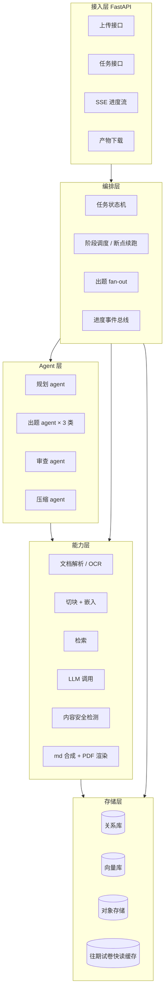
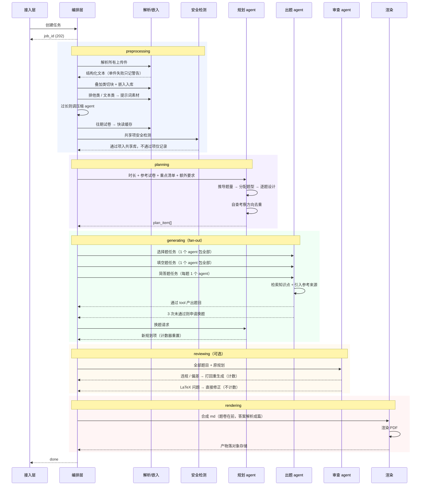
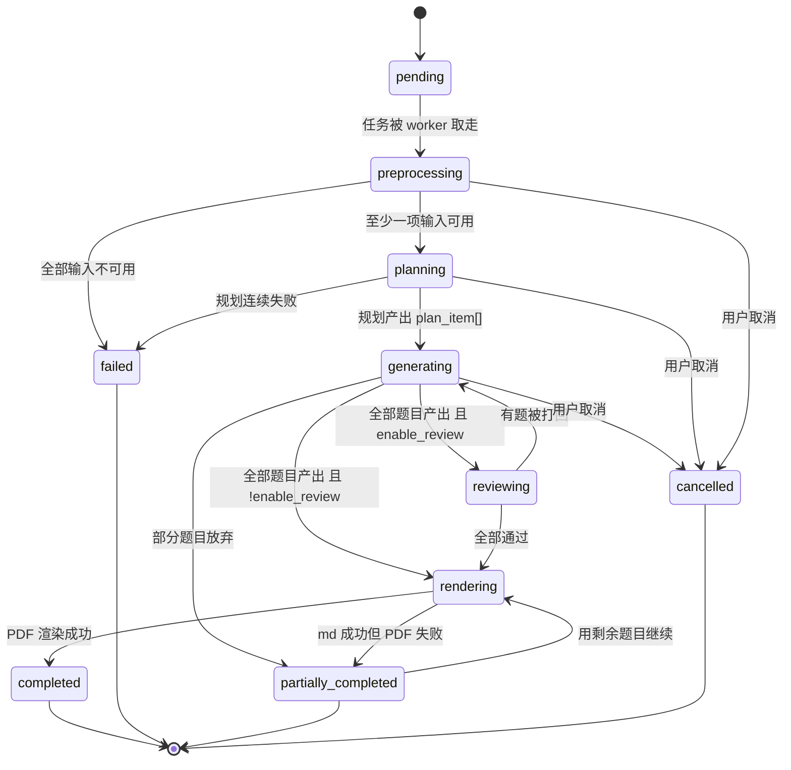

# 系统架构设计

后端为 Python + FastAPI。本文档描述分层、模块、全链路时序与任务状态机。

具体中间件（向量库、任务队列、LLM、渲染器）在本文档中以**能力接口**出现，不绑定具体产品；候选对比见 [tech-selection.md](./tech-selection.md)。

## 1. 分层



分层原则：

- **接入层不含业务逻辑**，只做校验、鉴权、序列化，以及把任务交给编排层
- **编排层不直接调 LLM**，它只负责阶段推进、并发控制、断点与进度；LLM 调用都在 Agent 层
- **Agent 层不直接碰存储**，它通过能力层的检索接口取数据。这样换向量库不影响 agent 代码
- **能力层是可替换的适配器**，每个能力位定义抽象接口 + 具体实现

## 2. 模块划分

```
app/
├── api/                    # 接入层
│   ├── uploads.py          # FR-1, FR-2
│   ├── jobs.py             # FR-9
│   ├── events.py           # FR-10 SSE
│   ├── artifacts.py        # md / PDF 下载
│   └── catalog.py          # 学校 / 课程列表
├── orchestration/          # 编排层
│   ├── state_machine.py    # 任务状态机
│   ├── stages.py           # 各阶段实现与顺序
│   ├── checkpoint.py       # NFR-3 断点续跑
│   ├── fanout.py           # 出题并发调度
│   └── events.py           # 进度事件总线
├── agents/                 # Agent 层
│   ├── planner.py          # 规划 agent
│   ├── question_writers.py # 选择 / 填空 / 简答
│   ├── reviewer.py         # 审查 agent
│   ├── compressor.py       # 压缩 agent
│   ├── tools.py            # 三个出题 tool 的 schema 与校验
│   └── prompts/            # 提示词模板
├── ingestion/              # 能力层：入
│   ├── parsers/            # 按格式的解析器
│   ├── ocr.py
│   ├── chunking.py
│   └── embedding.py
├── retrieval/              # 能力层：检索
│   ├── vector_store.py     # 抽象接口
│   ├── filters.py          # 排他 / 叠加策略 → filter 表达式
│   └── past_papers.py      # 往期试卷快读
├── moderation/             # 能力层：内容安全
│   └── moderator.py
├── rendering/              # 能力层：产出
│   ├── markdown.py         # md 合成
│   └── pdf.py              # PDF 渲染
├── models/                 # 关系库 ORM 模型
├── schemas/                # Pydantic 请求 / 响应模型
└── config.py
```

## 3. 全链路时序



## 4. 任务状态机



状态说明：

| 状态 | 含义 | 用户可见产物 |
| --- | --- | --- |
| `pending` | 已创建，等待调度 | 无 |
| `preprocessing` | 解析、嵌入、安全检测 | 无 |
| `planning` | 规划 agent 工作中 | 无 |
| `generating` | 出题中 | 已完成的题目数 |
| `reviewing` | 审查中 | 全部题目 |
| `rendering` | 合成与渲染 | 无 |
| `completed` | 全部成功 | md + PDF |
| `partially_completed` | 有题放弃，或 PDF 渲染失败 | md，可能有 PDF |
| `failed` | 无法产出 | 无 |
| `cancelled` | 用户主动取消 | 无 |

`reviewing → generating` 是唯一的回边，需防死循环：每题的重试计数是全局的（见第 6 节），耗尽即换题或放弃，不会无限回退。

## 5. 出题 fan-out 模型

idea.md 明确规定的分派方式：

| 题型 | agent 数量 | 理由 |
| --- | --- | --- |
| 选择题 | 1 个，包全部选择题 | 同一 agent 内可自然避免选项风格雷同、答案分布失衡 |
| 填空题 | 1 个，包全部填空题 | 同上 |
| 简答题 | 每题 1 个 | 简答题需要深度检索与较长输出，单题独占上下文质量更好 |

编排层实现为一个 map 阶段：

```
tasks = [
    ("choice",  all_choice_plan_items),      # 1 个任务
    ("blank",   all_blank_plan_items),       # 1 个任务
    *[("short", [item]) for item in short_plan_items],  # N 个任务
]
```

并发控制：

- 全局并发上限 `MAX_CONCURRENT_WRITERS` 【待定】，取决于所选 LLM 的速率限制（NFR-2）
- 失败隔离：单个 agent 抛错不影响其他 agent。选择题 agent 整体失败时，其负责的全部选择题进入重试；简答题 agent 失败只影响自己那一题
- 选择题/填空题 agent 内部若某一题不通过，只重生成该题，不重做整批

## 6. 幂等与断点续跑

NFR-3 要求任务重启后不重复付费。需要落盘的检查点：

| 检查点 | 落盘内容 | 重启后行为 |
| --- | --- | --- |
| 解析完成 | 每个上传件的结构化文本 | 跳过重新解析 |
| 嵌入完成 | 向量库中的 chunk（带 `resource_id`） | 按 `resource_id` 判断是否已入库 |
| 压缩完成 | 压缩后的提示词素材 | 跳过重新压缩 |
| 安全检测完成 | `moderation_record` | 跳过重新检测 |
| 规划完成 | `plan_item[]` 全量 | 直接进入出题阶段 |
| 单题通过 | `question` 行 + `retry_count` | 已通过的题不重新生成 |
| 审查通过 | 题目的审查标记 | 已通过的题不重新审查 |
| md 合成完成 | 对象存储中的 md | 只重跑 PDF 渲染 |

关键点：**检查点粒度到单题**。一份 25 题的试卷若在第 20 题时崩溃，重启只需生成剩余 5 题。

重试计数器 `retry_count` 也必须落盘，否则重启会重置计数，绕过 3 次上限。

## 7. 进度事件总线

SSE 需要把编排层与 Agent 层的进度推给前端。事件从内部总线发出，接入层订阅后转成 SSE 帧。

事件需持久化到 `job_stage` 表，原因有两个：轮询降级接口需要读到同样的状态（FR-10）；SSE 断连重连后需要补发错过的事件。

事件类型与 JSON 结构见 [api.md](./api.md#5-sse-事件)。

## 8. 可观测性

按 NFR-4，每个 `job` 需可聚合出：

| 指标 | 来源 |
| --- | --- |
| 各阶段耗时 | `job_stage` 的进入/离开时间戳 |
| token 用量 | 每次 LLM 调用记录 prompt/completion token，按 job 聚合 |
| 重试次数 | `question.retry_count` 求和 |
| 换题次数 | `question.replanned_from` 非空计数 |
| 解析失败文件数 | 警告记录 |
| 安全检测拦截数 | `moderation_record` 中不通过的计数 |

token 用量按 agent 角色分别统计，便于判断成本主要花在规划还是出题上。

## 9. 关键设计取舍

**为什么往期试卷不入向量库**
idea.md 要求规划与出题阶段「时常查看」往期试卷。切块后检索会丢失试卷的整体结构（题型分布、题目顺序、分值），而这恰恰是规划阶段最需要的信息。因此整份留存，规划时全文进上下文。详见 [data-model.md](./data-model.md#5-往期试卷的特殊处理)。

**为什么考察方向去重不用向量相似度**
idea.md 明确要求由主 agent 基于自身语义理解自查，不依赖额外基础设施。这也避免了引入一套阈值调参工作——语义相似度阈值在「相似考察方向」这种模糊判断上很难调准。

**为什么规划元信息不作为 tool 字段**
idea.md 规定知识点、题型、难度这些规划信息「仅在规划阶段内部使用，不作为出题 tool 的独立字段传递，而是隐式保存在最终生成的 md 文件中」。落地方式是 md 内的 HTML 注释，PDF 渲染时不可见。这样出题 agent 的 tool schema 保持精简，只关心题目本身。

**为什么状态机有 `partially_completed`**
一次任务包含数十次 LLM 调用，成本可观。全有或全无的语义会让「24 题成功 1 题失败」退化成完全失败，白付一次钱。`partially_completed` 让用户至少拿到已完成的部分。
