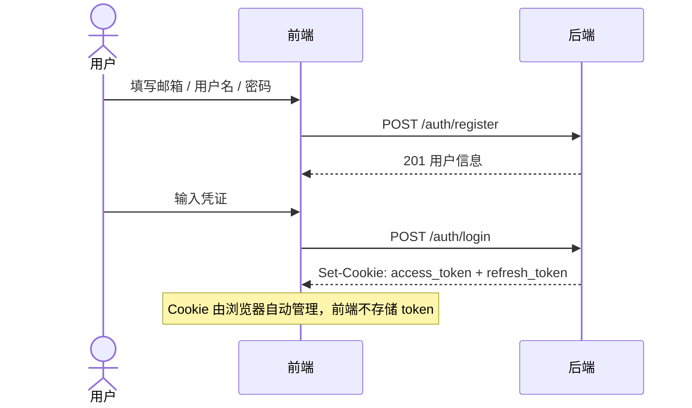
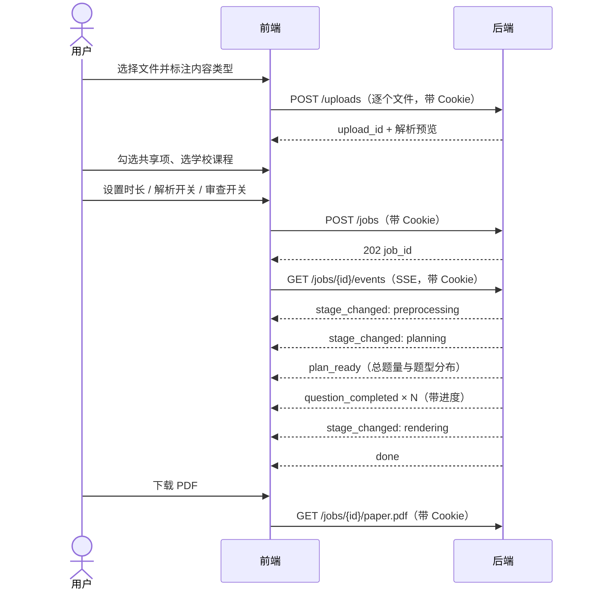
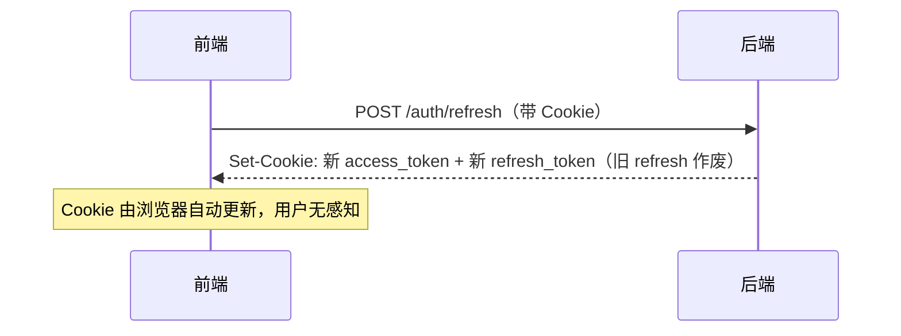

# 需求规格说明

本文档将 [idea.md](./idea.md) 的产品构想收敛为带验收标准的需求条目。术语与 `source_type` 枚举见 [README.md](./README.md#术语表)。

## 1. 产品定位

面向学生的试卷生成工具。用户上传手头的课程资料，系统据此生成一份贴合本课程考察范围的模拟试卷，并输出可直接打印的 PDF。

价值主张：把散落在书籍、课件、笔记、往期卷子里的考察范围，转成一份能当场做的卷子。

目标用户是学生本人，不是教师。这决定了两件事：产品不做班级管理与成绩统计；共享知识库的沉淀依赖学生自愿共享，而非教师投放。

## 2. 输入矩阵

这是全文最关键的一张表。它同时定义了「用户能传什么」「系统怎么处理」「能不能共享」「与共享库怎么合并」四件事。

| 内容类型 | `source_type` | 可接受形式 | 预处理程度 | 可否共享 | 取用策略 |
| --- | --- | --- | --- | --- | --- |
| 书籍资料 | `book` | docx / pptx / pdf / md / 图片 | 切块 → 向量化入库 | 可 | 叠加类 |
| 教师授课用件 | `lecture` | docx / pptx / pdf / md / 图片 | 切块 → 向量化入库 | 可 | 叠加类 |
| 用户学习笔记 | `note` | docx / pptx / pdf / md / 图片 | 切块 → 向量化入库 | 可 | 叠加类 |
| 重点知识点清单 | `keypoint_list` | docx / pptx / pdf / md / 图片 | 全文进提示词，过长则压缩 | 可 | 排他类 |
| 往期试卷 | `past_paper` | docx / pptx / pdf / md / 图片 | 整份留存于可快读存储 | 可 | 排他类 |
| 手动输入文本 | `manual_text` | 前端文本框 | 全文进提示词，过长则压缩 | **不可** | 仅本次 |
| 用户额外要求 | `extra_requirement` | 前端文本框 | 全文进提示词，过长则压缩 | **不可** | 仅本次 |

支持的文件格式：

- 文档：`.docx` `.doc` `.pptx` `.ppt` `.pdf` `.md` `.txt`
- 图片：`.jpg` `.jpeg` `.png` `.webp` `.bmp`（**不支持 `.gif` 等动态图片**）

取用策略的含义（对应 idea.md 的设计意图）：

- **排他类**：用户本次提供了该类型，就只用用户提供的，不再引入共享库同类内容。因为重点清单与往期试卷代表用户本次明确希望聚焦的范围，掺入其他来源反而会稀释。用户未提供时，才使用共享库中同校同课程的同类内容。
- **叠加类**：无论用户是否提供，都叠加共享库中同校同课程的同类内容。因为共享库里可能有用户没上传、但在本次考察范围中占相当比例的内容。

## 3. 功能需求

### 3.1 上传与输入

**FR-1 多格式上传**
用户可上传第 2 节所列格式的文件，单次可上传多个。上传时必须为每个文件指定 `source_type`。

验收：上传 `.docx` `.pptx` `.pdf` `.md` `.jpg` `.png` 各一份，均返回 `upload_id` 与解析预览；上传 `.gif` 被拒绝并返回 `UNSUPPORTED_FORMAT`。

**FR-2 手动输入文本**
用户可在文本框直接输入内容，作为 `manual_text`；额外要求单独一个输入框，作为 `extra_requirement`。

验收：两个文本框的内容分别以对应 `source_type` 落库，且 `shareable` 字段为 `false`。

**FR-3 至少一项输入**
所有输入（文件与文本框）不得同时为空。

验收：空提交返回 400 与 `INPUT_EMPTY`；仅有 `manual_text` 一项时允许提交并能完成生成。

**FR-4 共享选择**
用户可按上传件粒度选择是否共享。`manual_text` 与 `extra_requirement` 在前端不呈现共享选项，在后端也拒绝共享请求。

验收：对 `manual_text` 传入 `share_consent` 时返回 400；对 `book` 传入后，该资源在通过安全检测后出现于对应学校课程的共享库。

**FR-5 学校与课程归属**
共享需要指定学校与课程。用户可从已有列表中选择。

验收：选择共享但未提供 `school_id` 或 `course_id` 时返回 400。

### 3.2 生成选项

**FR-6 解析开关**
用户在生成前选择是否为每道题生成答案解析。选择需要，则所有题目都带解析；不选择，则一道都不生成。

验收：`need_explanation=false` 时，产出的 md 与 PDF 中不含任何解析段落；`true` 时每题都有。

**FR-7 考试时长**
用户可设置考试时长，默认 100 分钟。题量由规划 agent 依据时长自主决定，有往期试卷时以往期试卷为主要锚点。推导规则见 [agent-design.md](./agent-design.md#1-题量推导)。

验收：时长设为 50 分钟时，产出题量显著少于默认 100 分钟；未传该字段时按 100 分钟处理。

**FR-8 审查开关**
用户可选择是否启用审查阶段。

验收：`enable_review=false` 时任务状态机跳过 `reviewing`，SSE 不产生 `review_result` 事件。

### 3.3 生成过程

**FR-9 异步任务**
创建生成任务立即返回 `job_id`，不阻塞等待生成完成。

验收：`POST /jobs` 在 1 秒内返回 202 与 `job_id`。

**FR-10 进度查看**
用户可通过 SSE 实时查看阶段变化与题目级进度；同时提供轮询接口作为降级方案。

验收：SSE 连接可收到 `stage_changed` 与带 `completed/total` 的 `question_completed` 事件；断开后改用轮询能取到一致的状态。

**FR-11 题型占比约束**
有参考试卷时，各题型占比相对变动不超过 10%（如原占比 30%，允许 27%~33%）。算法见 [agent-design.md](./agent-design.md#2-题型占比分配)。

验收：给定一份 30%/20%/50% 的往期试卷，产出试卷各题型占比均落在对应的相对区间内，且原本存在的题型不消失。

**FR-12 题目不得原样照搬**
题目内容必须作出改变。唯一例外：概念性填空题（如对某现象的解释类题目）允许原封不动迁移；简单计算题仅修改数值即可。

验收：给定一份往期试卷，产出题目与原题逐条对比，除概念性填空题外不存在完全相同的题干。

**FR-13 考察方向去重**
同一重点的相同或相似考察方向不得出现超过两次。由主 agent 基于语义理解自查，不引入向量相似度等额外基础设施。

验收：产出试卷中不存在三道及以上考察同一重点同一方向的题目。

**FR-14 重试与换题**
单题因内容问题连续重新生成 3 次仍不通过时，不再重试，改为向主 agent 申请更换该题的知识点或考察方向。协议见 [agent-design.md](./agent-design.md#4-重试与换题协议)。

验收：构造一个必然不通过的知识点，观察到 3 次重试后触发 `question_replanned` 事件，任务最终仍能完成。

### 3.4 内容安全与共享

**FR-15 入库前自动安全检测**
用户选择共享的内容在进入共享知识库前必须通过自动内容安全检测。检测为程序自动执行，无人工审核环节。检测不通过则不予收录。

验收：含违规内容的资源标记为共享后，不出现在共享库中，且 `moderation_record` 留有记录。

**FR-16 检测失败不影响本次生成**
共享内容安全检测不通过，只影响是否入共享库，不影响本次试卷生成——用户自己的内容仍然可用。

验收：安全检测不通过的情况下，本次任务仍正常完成并产出试卷。

**FR-17 出题结果违规检查**
启用审查时，检查产出题目是否含违规内容（如知识库中并未明确提及的政治敏感内容、色情内容），命中则要求重新生成。

验收：审查阶段命中违规时产生 `question_retried` 事件且重试计数递增。

### 3.5 产出

**FR-18 md 合成**
所有题目整合到一个 md 文件。题卷在前，答案与解析单独成篇。

验收：产出 md 中题目区与《参考答案与解析》区分离，题号连续且两区一一对应。

**FR-19 PDF 渲染**
md 渲染为 PDF 返回给用户。中文正常显示，LaTeX 公式正确渲染。

验收：含行内与块级公式的试卷渲染后，公式显示正确，无乱码、无缺字。

**FR-20 LaTeX 渲染兜底**
审查阶段检查题目中的公式是否存在 md 无法渲染的情况，发现即直接修正，不计入重试次数。

验收：注入一个不被渲染器支持的宏，审查阶段将其改写为等价可渲染形式，`retry_count` 不变。

### 3.6 鉴权与用户

**FR-21 注册**
用户可注册账号（邮箱 + 用户名 + 密码）。邮箱与用户名均唯一。

验收：用已存在的邮箱或用户名注册返回 409 `USER_EXISTS`；成功注册后返回该用户信息。

**FR-22 登录与 Cookie 认证**
用户登录成功获得 httpOnly Cookie：`access_token`（JWT，15 分钟）与 `refresh_token`（不透明令牌，30 天）。前端请求携带 `withCredentials: true`，浏览器自动附带 Cookie。

验收：登录成功返回用户信息；响应头中 Set-Cookie 包含两个 httpOnly Cookie；前端请求不携带 Authorization 头。

**FR-23 刷新与轮换**
Access token 过期时，后端自动使用 Cookie 中的 refresh_token 进行轮换（旧 refresh_token 立即失效，签发同族新 token），通过 Set-Cookie 返回新 token。

验收：access token 过期后调用业务接口，后端透明续期，用户无感知；连续刷新得到同 `family_id` 的新 token。

**FR-24 登出**
用户登出时，后端吊销其 refresh token 并清除 `access_token` 与 `refresh_token` Cookie，此后该 refresh token 无法再用于刷新。

验收：登出后 Cookie 被清除；调用 `/auth/refresh` 返回 401 `REFRESH_INVALID`。

**FR-25 资源归属鉴权**
所有上传件与任务资源在读写时校验归属于当前用户，越权访问按 404 处理（不泄露资源是否存在）。

验收：用户 A 访问用户 B 的 `job_id` 返回 404 `JOB_NOT_FOUND`；未携带有效 access token 返回 401。

## 4. 非功能需求

**NFR-1 单任务时长**
默认 100 分钟时长的试卷（约 20~30 题），端到端目标 5 分钟内完成，上限 15 分钟。超过上限标记为 `failed`。

**NFR-2 并发**
出题阶段的子 agent 并发需设上限，避免打满 LLM 配额。具体值 【待定】，取决于所选 LLM 的速率限制。

**NFR-3 断点续跑**
任务进程重启后，已完成的预处理结果、规划结果、已通过的题目不重复生成。这是成本要求，不只是性能要求——重跑意味着重复付费。

**NFR-4 可观测性**
每阶段记录耗时、token 用量、重试次数、换题次数，可按 `job_id` 聚合查询。

**NFR-5 单文件失败隔离**
单个上传件解析失败不阻塞整个任务，在任务结果中以警告形式报告。

**NFR-6 内容合规**
面向学生的教育类产品，需满足境内生成式 AI 相关监管要求（安全评估、算法备案、内容标识、未成年人保护）。合规要点见 [tech-selection.md](./tech-selection.md#8-内容安全)。

**NFR-7 数据留存与删除**
用户可删除自己的任务及其产物。已共享并通过检测的资源不随个人任务删除而消失，因为它已进入公共知识库。此规则需在用户共享时明确告知。

**NFR-8 Cookie 安全策略**
access token 15 分钟、前端内存不落地；refresh token 30 天、服务端仅存 SHA-256 哈希；refresh token 每次刷新时轮换，检测到重放则吊销整条链（`family_id`）的全部 token。Cookie 属性为 httpOnly、Secure（生产环境）、SameSite=Lax。设计见 [data-model.md](./data-model.md#8-鉴权与用户系统)。

## 5. 用户流程

### 5.1 注册与登录

### 5.2 主流程

### 5.3 Cookie 刷新

### 5.4 异常流程

**E-1 部分文件解析失败**
单文件解析失败 → 记录警告 → 其余文件继续 → SSE 推送 `warning` → 任务正常完成 → 结果中列出失败文件。若**全部**文件都失败且无手动输入，任务转 `failed`。

**E-2 共享内容未通过安全检测**
资源标记共享 → 安全检测不通过 → 不入共享库 → 记录 `moderation_record` → SSE 推送 `warning` 告知用户该项未被收录 → 本次生成不受影响，正常完成。

**E-3 单题重试耗尽**
子 agent 3 次未通过 → 向主 agent 申请换题 → 主 agent 更换知识点或考察方向 → 重新下发（计数器重置）→ 若换题后仍失败，该题标记为放弃 → 任务转 `partially_completed`，产出的试卷题量少于计划并明确说明。

**E-4 无任何可用输入**
所有输入为空 → 400 `INPUT_EMPTY`，前端应在提交前拦截，后端仍需校验。

**E-5 渲染失败**
md 已生成但 PDF 渲染失败 → 任务转 `partially_completed` → md 仍可下载 → 返回 `RENDER_FAILED` 说明 PDF 不可用。这样至少不丢失已付出的 LLM 成本。

## 6. 边界情况

| 情况 | 处理 |
| --- | --- |
| 所有输入为空 | 400 `INPUT_EMPTY` |
| 仅有手动输入文本 | 允许。不进向量库，直接进提示词 |
| 上传了图片但无法 OCR | 该文件记为解析失败，不阻塞任务 |
| 扫描版 PDF（无文本层） | 走 OCR；OCR 失败则记为解析失败 |
| 加密 PDF | 拒绝，返回 `PDF_ENCRYPTED` |
| 文件超过大小上限 | 拒绝，返回 `FILE_TOO_LARGE` |
| 格式不支持（如 `.gif`） | 拒绝，返回 `UNSUPPORTED_FORMAT` |
| 重点清单 + 额外要求过长 | 触发压缩 agent，压缩后进提示词 |
| 往期试卷题型只有一种 | 按该题型 100% 处理，相对变动约束自动满足 |
| 往期试卷有多份 | 综合参考取较大共同点（题型分布、知识点覆盖、难度分配三个维度） |
| 用户未提供往期试卷，共享库也没有 | 按 20% 选择 / 20% 填空 / 60% 简答 的基本模板 |
| 用户未提供重点清单 | 尽可能多地参考共享库中的重点清单 |
| 用户提供了重点清单 | 只用用户的，不参考其他来源 |
| 选择共享但未选学校课程 | 400，共享必须有归属 |
| 时长设置过短（如 5 分钟） | 允许，题量相应减少，但至少 1 题 |
| 未登录调用受保护端点 | 401 `TOKEN_MISSING` |
| access token 过期 | 401 `TOKEN_EXPIRED`，后端透明续期 |
| refresh token 已吊销/失效 | 401 `REFRESH_INVALID`，引导重新登录 |
| refresh token 重放（复用已吊销的 token） | 401 `REFRESH_REUSE_DETECTED`，吊销整条链，重新登录 |
| 访问他人资源 | 404，不泄露资源是否存在 |

## 7. 非目标

首版明确不做：

- 在线答题与自动批改
- 班级、成绩、教师管理功能
- 多语言（仅中文）
- 人工审核后台（安全检测为全自动）
- 试卷的二次编辑（产出即最终，不提供改题界面）
- 动态图片（gif 等）解析
- 第三方登录（OAuth）、手机验证码、邮箱验证、找回密码（首版仅邮箱/用户名 + 密码）
- 多设备独立会话管理（refresh token 链族模型下并发刷新会互相吊销，见 [data-model.md](./data-model.md#8-鉴权与用户系统)）

